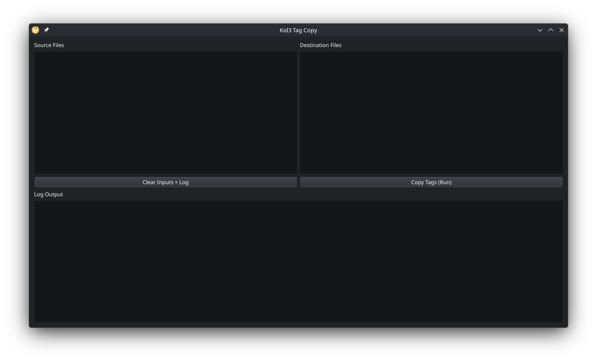

# Kid3 Tag Copier

A simple tool for copying metadata tags from one audio file to another using Kid3.

## Installation

Ensure `kid3-cli` is installed using apt, pacman, dnf, etc.

```shell
# Debian-based (Ubuntu-based)
sudo apt install kid3-cli

# Arch-based
sudo pacman -S kid3
paru -S kid3

# Fedora
sudo dnf install kid3
```

### pipx

Install using `pipx`:

```shell
pipx install git+https://github.com/WhonderWy/kid3-tag-copy.git
```

### AppImage

Download [and `chmod +x`] from Releases.

## Usage

Run without arguments for GUI mode.

```shell
kid3-tag-copy --src a1.mp3 a2.mp3 a3.mp3 --dst b1.flac b2.flac b3.flac
```
